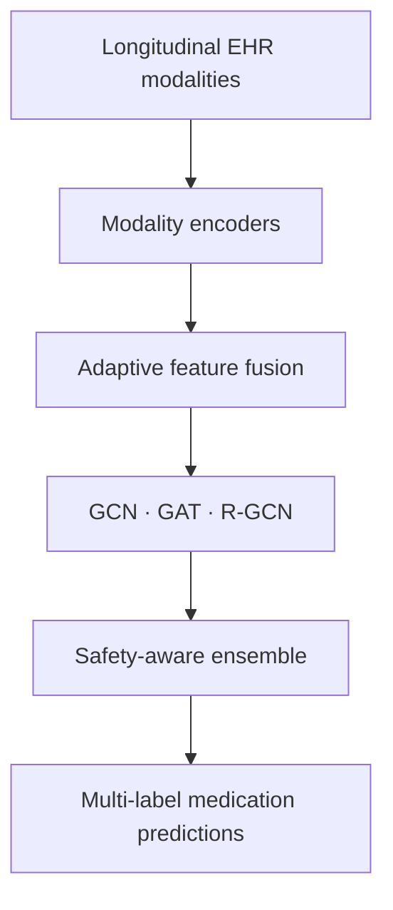

# Safety-Aware Ensemble GNNs for Medication Recommendation

Research code for admission-level medication recommendation from longitudinal electronic health records using graph neural networks and safety-aware ensemble learning.

> **Research use only:** this project is a retrospective machine-learning study and is not a clinical decision-support system.

## Overview

The task is formulated as multi-label prediction of medication classes for a hospital admission. The study uses MIMIC-IV and compares three graph neural network families:

- Graph Convolutional Network (GCN)
- Graph Attention Network (GAT)
- Relational Graph Convolutional Network (R-GCN)

The models integrate diagnoses, procedures, prior medication history, laboratory measurements, and demographic and admission information. Longitudinal histories are represented with temporally directed edges so that an admission can receive information only from earlier completed admissions.

## Method



The project investigates:

- modality-specific representation learning;
- adaptive feature gating;
- leakage-safe temporal graph construction;
- patient-disjoint evaluation;
- ensemble learning across complementary GNN architectures;
- drug–drug interaction (DDI)-aware training and evaluation;
- explainability for clinical decision-support research.

The ensemble methodology is the principal contribution of the ongoing research. Its exact construction and trained artifacts are withheld until publication.

## Preliminary results

The table reports representative validation results from the thesis experiments. Jaccard similarity is the primary metric.

| Model | Validation Jaccard |
|---|---:|
| GCN | 0.5284 |
| GAT | 0.5322 |
| R-GCN | 0.5506 |
| Ensemble | **0.5520** |
| Safety-aware ensemble | 0.5516 |

The safety-aware ensemble achieved a severe-DDI rate of 0.0123 while retaining similar predictive performance. These results are retrospective, dataset-specific, and not evidence of clinical efficacy.

## Repository structure

```text
src/medrec/
├── models/       # Public GCN, GAT, and R-GCN architectures
├── losses.py     # Multi-label and DDI-aware objectives
├── metrics.py    # Evaluation and threshold selection
├── temporal.py   # Leakage-safe longitudinal graph utilities
└── training.py   # Reproducible training helpers

tests/            # Lightweight validation tests
docs/             # Data-access and reproducibility notes
notebooks/        # Guidance for restricted-data experiments
```

## Installation

Python 3.10 or later is recommended.

```bash
git clone https://github.com/evamlk/medication-recommendation.git
cd medication-recommendation
pip install -e .
```

The public modules can then be imported directly:

```python
from medrec.losses import SafetyAwareBCELoss
from medrec.metrics import multilabel_metrics
from medrec.models import MedicationGCN
```

## Data access and privacy

MIMIC-IV is a credentialed-access clinical dataset and is not included in this repository. No patient-level data, identifiers, model prediction bundles, checkpoints, or licensed DrugBank files are distributed here.

Researchers wishing to reproduce the full study must obtain access to MIMIC-IV independently and comply with its data-use agreement. See [the data-access notes](docs/data-access.md) for details.

## Reproducibility scope

This repository contains reusable model architectures, temporal graph utilities, evaluation functions, and safety-aware training components. Dataset-specific preprocessing, private artifacts, and the unpublished ensemble implementation are not currently distributed.

## Tools

Python · PyTorch · PyTorch Geometric · scikit-learn · pandas · NumPy · SQL

## Citation

A thesis and related manuscript are in preparation. Citation information will be added after publication.

## Status

Active research project.
